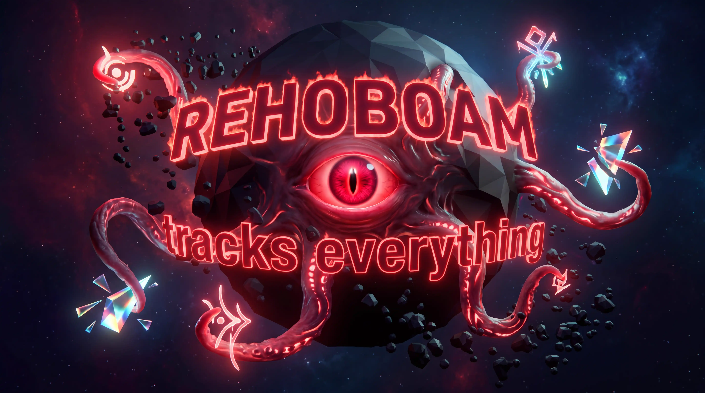
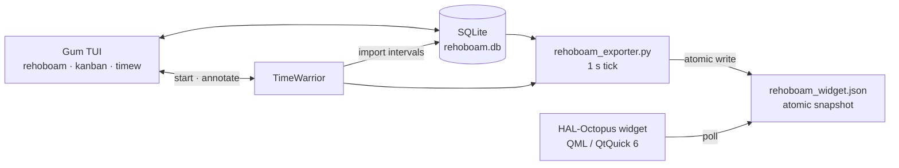

<h1 align="center">REHOBOAM</h1>

<p align="center">
<b>An octopus-armed task board with a HAL 9000 eye — a gum TUI, TimeWarrior tracking, and a live Plasma 6 widget.</b>
</p>

<p align="center">
  
  
  
  
  
  
</p>


<br/>

REHOBOAM is a task-management and time-tracking suite with a single source of
truth: a SQLite database. It wears two faces:

- a **gum-based terminal suite** (`rehoboam`, `kanban`, `timew`) for board
  management and TimeWarrior tracking;
- a **Plasma 6 widget** — *HAL-Octopus* (`org.rehoboam.hal-octopus`) — that
  renders the open board as glowing nodes on a HAL 9000 eye, with click-to-track,
  a hover popup, and a full KDE configuration dialog.

---

## Features

- 🐙 **HAL-Octopus widget** — live task eye: open tasks orbit as nodes on
  octopus arms, the active task glows with live elapsed time, and the pupil
  locks onto it. Hover for details, click to track.
- 📋 **SQLite board** — groups and tasks live in a local SQLite database,
  managed from the TUI or the widget dialog.
- ⏱️ **TimeWarrior integration** — start, stop, switch, and cancel tracking from
  the TUI or by clicking widget nodes. Every interval is tagged with the task's
  group and annotated with its description.
- 📊 **Reports** — today and week summaries plus per-task totals from the
  imported `time_entries` table.
- ⚙️ **Configuration dialog** — three KCM pages (Board, TimeWarrior, Widget)
  with atomic write-through to `~/.config/rehoboam/config`.

## Tech stack

| Layer | Technology |
|---|---|
| Widget | Plasma 6 / Qt6 / QtQuick 6 + Shapes, KConfigSkeleton |
| TUI | bash 5+, [gum](https://github.com/charmbracelet/gum) |
| Backend | Python 3.9+ (stdlib only), SQLite |
| Tracking | [TimeWarrior](https://timewarrior.net/) 1.9+ |

## Architecture



1. `~/.config/rehoboam/config` is loaded by `common.sh` and parsed by
   `rehoboam_db.py`.
2. The TUI mutates the board through `rehoboam_db.py`.
3. Finished `timew` intervals are imported into `time_entries`, deduplicated by
   `UNIQUE(start, end)`.
4. `rehoboam_exporter.py` polls the DB and TimeWarrior once per second and
   writes the widget snapshot atomically (tmp file + rename, single instance via
   `flock`).
5. The widget polls the snapshot and renders the tasks as eye nodes.

## Quick start

### Requirements

```txt
KDE Plasma 6 (Qt 6 / QtQuick 6)   # widget only
Python 3.9+                        # stdlib only, no pip installs
TimeWarrior 1.9+                   # time tracking
gum                                 # TUI only
```

### 1. Clone

```bash
git clone <your-repository-url> rehoboam
cd rehoboam
```

### 2. Install

```bash
./install.sh
```

The installer copies the project to `~/.local/share/rehoboam`, patches the
machine-specific paths baked into the widget QML, installs the plasmoid, and
links the commands into `~/.local/bin` (`rehoboam`, `kanban`, `timew`,
`rehoboam-config`, `rehoboam-exporter`, `rehoboam-reload`). It then starts the
exporter via a systemd user unit (or XDG autostart) and restarts plasmashell.

```bash
./install.sh --prefix DIR         # custom install prefix
./install.sh --no-links           # skip ~/.local/bin symlinks
./install.sh --no-autostart       # skip exporter autostart setup
./install.sh --no-restart         # don't restart plasmashell afterwards
./install.sh --uninstall          # remove installed artifacts
./install.sh --uninstall --purge  # also delete config, DB, and caches
```

> [!NOTE]
> `~/.local/bin` must be on your `PATH`: `export PATH="$HOME/.local/bin:$PATH"`.

### 3. Run it

```bash
rehoboam           # TUI dashboard
rehoboam-exporter  # widget state daemon (auto-started by the installer)
```

In Plasma, right-click the desktop → **Add Widgets…** → **HAL-Octopus**.

### Manual setup (no installer)

```bash
mkdir -p ~/.config/rehoboam
ln -s ~/path/to/rehoboam ~/.local/share/rehoboam   # optional
echo 'export PATH="$HOME/rehoboam:$PATH"' >> ~/.bashrc
```

```bash
nohup python3 ~/rehoboam/rehoboam_exporter.py >> /tmp/rehoboam_exporter.log 2>&1 &
```

The exporter is single-instance (`flock` on `~/.cache/rehoboam_widget.lock`)
and writes `~/.cache/rehoboam_widget.json` once per second.

## Configuration

`~/.config/rehoboam/config` is a `KEY=VALUE` file (shell-quoted values) that
`common.sh` sources directly and `rehoboam_db.py` parses. The widget dialog
rewrites it atomically.

| Key | Default | Used by |
|---|---|---|
| `REHOBOAM_DB_PATH` | `~/.config/rehoboam/rehoboam.db` | `rehoboam_db.py` |
| `HIDDEN_GROUPS` | *(unset)* | `rehoboam_exporter.py` |

> [!TIP]
> Set `HIDDEN_GROUPS` to a comma-separated list of group names to hide from the
> octopus eye. It's re-read every tick and affects display only — tracking and
> the TUI are unaffected. Group names containing commas are not supported.

## CLI / TUI usage

### `rehoboam` — dashboard

The entry point: shows the banner and hands off to the other menus.

```text
🗂️  Board   ⏱️  TimeW   ✖  Quit
```

### `kanban` — board management

| Action | What it does |
|---|---|
| `📋 Show Tasks` | List open tasks; pick one to mark done |
| `➕ Add Task` | New task under a chosen group |
| `🗃️ Add Task Group` | Create a board column |
| `✏️ Edit / Delete Task` | Reword, move to another group, or delete |
| `📁 Edit / Delete Group` | Rename, or delete (with all its tasks) |

### `timew` — time tracking & reports

| Action | What it does |
|---|---|
| `▶ Start` | Pick a task, `timew start GROUP` + annotate |
| `■ Stop` | Stop and sync the interval into the DB |
| `↻ Continue` | Resume the last interval |
| `⏭ Switch Task` | Stop current tracking, then start another |
| `🚫 Cancel Current` | Discard the running interval |
| `⏱ Status` | Live elapsed time of the current interval |
| `📊 Today Summary` | DB-backed report for today |
| `🗓 Week Summary` | DB-backed report for the last 7 days |
| `🏷 Task Totals` | Today + cumulative totals per task |
| `➕ Add Time Manually` | `timew track ...` for untracked time |

```bash
timew start todo                # tag = the group name
timew annotate @1 "fix bug"     # annotation = the task description
```

## The widget

- **Eye** — open tasks render as nodes on bezier octopus arms. When tracking,
  the active node glows, its arm flashes, and the pupil locks onto it.
- **Click to track** — click a node to start TimeWarrior, click the active node
  to stop, click another node to switch. Updates land within ~1 s.
- **Right-click menu** — right-click a node for *Mark done* (moves it to the
  `done` group), *Postpone* (moves it to the `future` group), or *Delete*.
  Changes land within ~1 s.
- **Hover popup** — after `hoverDelay` ms, a card shows category, run time, task
  `#id`, and description.
- **Polling** — the widget polls the state file every `pollInterval` seconds
  (values are in seconds, clamped to ≥ 1 s).

### Snapshot schema

`~/.cache/rehoboam_widget.json`:

```json
{
  "timestamp": "2026-08-04T00:35:07",
  "active_task_id": 25,
  "tasks": [
    {
      "id": 25,
      "description": "add change task group to edit task section (rehoboam)",
      "group": "todo",
      "category": "@todo",
      "run_seconds": 3725,
      "run_time": "1h 2m",
      "is_active": true
    }
  ]
}
```

If a tick fails, an `error` field replaces `tasks`; the widget stays alive and
shows the problem (plus an `OFFLINE` label when the snapshot isn't reachable).

### Configuration dialog (right-click → *Configure …*)

- **Board** — add a task (group dropdown + title) and tick groups to hide from
  the eye. Edits write through to `~/.config/rehoboam/config`.
- **TimeWarrior** — start tracking from live group/task dropdowns, stop /
  continue, and tune `maxtracking`, `verbose`, and `confirmation`.
- **Widget** — `stateFile`, `pollInterval` (s), `hoverDelay` (ms).

## `rehoboam_config.py`

The Plasma dialog and the widget can't pass arbitrary text on the command line,
so QML URL-encodes every value (`encArg`) and this helper decodes it.

```bash
rehoboam-config get KEY                 # value from ~/.config/rehoboam/config
rehoboam-config set KEY VALUE           # set, atomic rewrite
rehoboam-config cat PATH                # print a file's contents
rehoboam-config list                    # {"groups": [...], "tasks": {group: [...]}}
rehoboam-config get-timew KEY           # current timew config value
rehoboam-config timew-config KEY VALUE  # timew config KEY VALUE
rehoboam-config timew-start GROUP TASK  # timew start + annotate @1
rehoboam-config timew-switch GROUP TASK # stop current, then start + annotate
rehoboam-config add-task GROUP TITLE    # add a task to the board (DB)
rehoboam-config task-done ID            # mark task done (moves to 'done' group)
rehoboam-config task-delete ID          # delete a task
rehoboam-config task-move ID GROUP      # move a task to another group
```

## TimeWarrior integration

- `timew start GROUP` — the **tag** is the group name.
- `timew annotate @1 TASK-DESCRIPTION` — the **annotation** is the task
  description, used for attribution.
- Import matches an annotation to a task: first an exact description match, then
  a fallback requiring the group tag to equal the task's group with a fuzzy
  description match. Unmatched intervals are stored with `task_id = NULL` and
  surface as "(unmatched intervals)" in reports.
- Intervals are imported on demand and every 30 ticks by the exporter;
  `UNIQUE(start, end)` prevents duplicates.

## Database schema

```sql
groups        (id, name UNIQUE, position)
tasks         (id, group_id FK→groups ON DELETE CASCADE, description,
               is_done, position, created_at, updated_at)
time_entries  (id, task_id FK→tasks ON DELETE SET NULL, timew_id,
               start, end, duration_seconds, UNIQUE(start, end))
```

`init_db()` also migrates the legacy `time_entries` schema (positional
`timew_id UNIQUE` → `UNIQUE(start, end)`), dropping derived data and rebuilding
it.

## Repository layout

```txt
rehoboam/
├── hal-octopus/                    # Plasma 6 widget (org.rehoboam.hal-octopus)
│   ├── metadata.json               # v1.2, GPL-2.0-or-later
│   └── contents/
│       ├── config/
│       │   ├── main.xml            # KConfigSkeleton: stateFile, pollInterval, hoverDelay
│       │   └── config.qml          # dialog tabs: Board / TimeWarrior / Widget
│       └── ui/
│           ├── main.qml            # HAL eye, task nodes, click-to-track, hover popup
│           ├── configGeneral.qml   # state file, poll interval, hover delay
│           ├── configKanban.qml    # add task, hidden groups
│           └── configTimew.qml     # tracking actions + timew settings
├── rehoboam_db.py                  # SQLite layer, timew import, reports
├── rehoboam_config.py              # CLI helper for the widget dialog
├── rehoboam_exporter.py            # widget-state daemon (atomic JSON, 1 s tick)
├── common.sh                       # shared config, banner font, DB/shell helpers
├── rehoboam.sh                     # TUI entry point
├── kanban.sh                       # Board management (gum)
├── timew.sh                        # TimeWarrior front end + reports
├── install.sh                      # portable installer / uninstaller
└── reload-widget.sh                # dev loop: lint → sync → reload widget
```

## Development

```bash
./reload-widget.sh   # qmllint → rsync to the plasmoid dir → clear caches → restart plasmashell
```

Gotchas:

- The Plasma executable engine runs commands via `/bin/sh` — shell-special
  characters must stay percent-encoded (`encArg`).
- The widget timer is in **milliseconds**; `pollInterval` (seconds) is
  multiplied by 1000 and clamped to ≥ 1 s.
- Don't pipe the helper through truncating tools when testing — a closed pipe
  delivers SIGPIPE and can kill the `timew` subprocess mid-write.

## Troubleshooting

| Symptom | Fix |
|---|---|
| Widget shows nothing / no node updates | Is the exporter running? Check `~/.cache/rehoboam_widget.json` and `journalctl --user -b \| grep rehoboam` |
| `sh: syntax error near unexpected token` | Unencoded shell-special characters — always use `encArg`/URL-encoded args |
| `OFFLINE` label on the widget | Snapshot path wrong or daemon down — check `stateFile` under *Configure → Widget* |
| `SimpleKCM ... cfg_*` dialog warnings | Cosmetic; declare the unused `cfg_*` properties on the page |

## Contributing

- Code is plain bash + Python stdlib + QML — no build step, no dependencies to
  vendor.
- After touching widget QML, iterate with `./reload-widget.sh`.
- Follow the existing patterns: helpers go through `rehoboam_db.py`, and values
  crossing the QML/Python boundary stay URL-encoded.

## License

GPL-2.0-or-later.